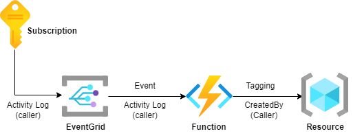

# Automatic Tagging by EventGrid and Azure Functions
리소스 생성시 생성자를 태그로 자동 등록해주는 시스템



## Tag Example
- ```Created By: 홍길동```

## Automation Flow
1. Resource creation event fired
2. EventGrid delivery message to Azure Function -> Subscription's Activity Logs(EventGrid Schema)
3. Azure Function's powershell function activation -> Tagging resources

## How to Use
1. Azure Functions 생성
    1. Function spec 
        - OS: Windows
        - Runtime Stack: Powershell 7.2
        - Function(Trigger) 
            - Template: EventGridTrigger
            - Script: 'tagging_v2/run.ps1'
        - Appfiles: requirements.psd1
            ```
            # Untag below
            'Az' 'x.x'
            ```
        - Identity: SystemAssigend
            - Role: Tag Contributor

2. EventGrid 생성
    - [Script]
        - Excute 'tagging_v2/eventgrid.sh'
    - [Manual]
        - Subscription -> Event -> + Event Subscription
            - EventGrid System Topic
                - type: Subscription
            - Event Subscription
                - Event Type: Microsoft.Resources.ResourceWriteSuccess
                - Endpoint: Azure Function's EventGrid Trigger
                - Advanced Filter: 
                    - data.operationName StringNotIn Microsoft.Resources/tags/write
                    - data.operationName StringIn Microsoft.Compute/disks/write, more...

## Info
- 리소스 생성일에 대한 태그는 Azure Policy로 구현 가능
    - Azure Policy는 utcNow() 함수를 호출할 수 있으며, 생성일은 utcNow()함수를 통해 태깅 가능
- Azure Policy 에서는 리소스의 속성값을 참조할수 있으며, 생성자의 경우 리소스 속성에는 명시되지 않고, Activity Logs에서 확인이 가능 하므로, 정책에선 생성자 식별이 불가능함
- Function의 Contents (ps1파일 등등)는 함께 생성한 StorageAccount에 존재, Function -> Configuration -> Application Setting -> 'AzureWebJobsStorage' 확인